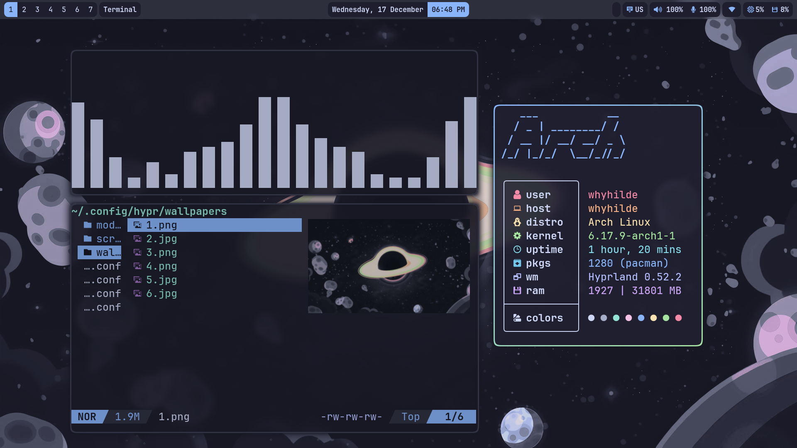
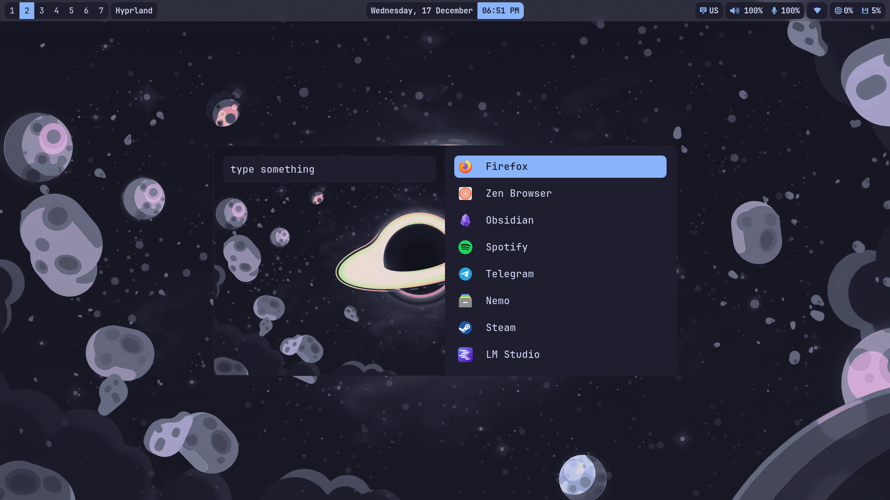
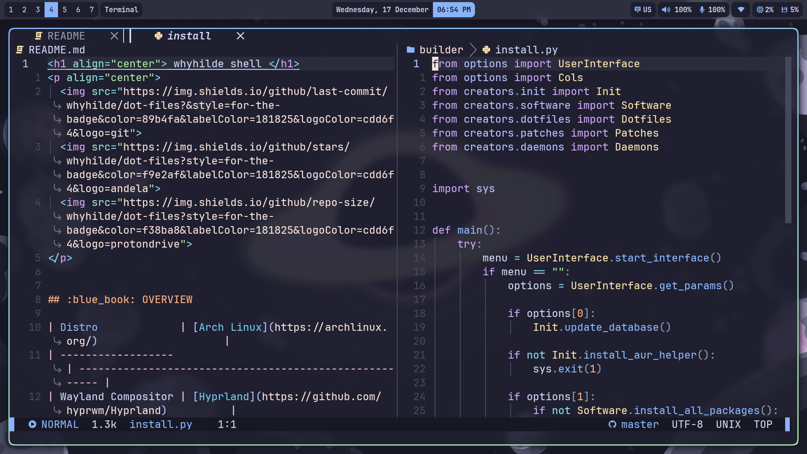
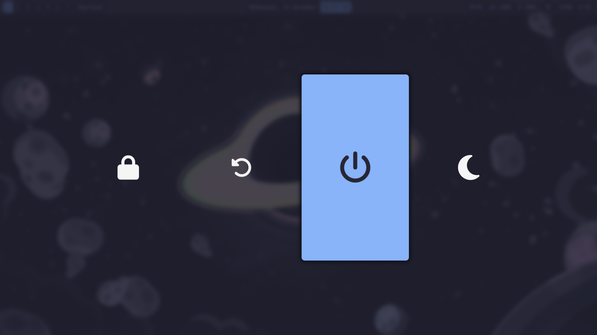

<h1 align="center">whyhilde shell</h1>
<p align="center">
  
  
  
</p>


<h2 align="center">overview</h2>

| Distro             | [Arch Linux](https://archlinux.org/)                    |
| ------------------ | ------------------------------------------------------- |
| Wayland Compositor | [Hyprland](https://github.com/hyprwm/Hyprland)          |
| Status Bar         | [Waybar](https://github.com/Alexays/Waybar)             |
| App Launcher       | [Rofi](https://github.com/davatorium/rofi)              |
| Notifications      | [Mako](https://github.com/emersion/mako)                |
| Browser            | [Zen](https://zen-browser.app)                          |
| Terminal           | [Ghostty](https://github.com/ghostty-org/ghostty)       |
| Shell              | [Fish](https://github.com/fish-shell/fish-shell)        |
| Code Editor        | [Neovim](https://github.com/neovim/neovim)              |
| Fetch              | [Fastfetch](https://github.com/fastfetch-cli/fastfetch) |


<h2 align="center">features</h2>

- Beautiful and minimalistic system.
- Customizing software on the system.
- All hotkeys are honed for maximum productivity.
- A very lightweight system that consumes less than 1GB of memory.
- Automatic installation and configuration of all basic software for development.


<h2 align="center">previews</h2>

| Desktop                    | Launcher                    |
| -------------------------- | --------------------------- |
|  |  |

| Neovim                     | Powermenu                    |
| -------------------------- | ---------------------------- |
|   |  |


<h2 align="center">installation</h2>

> [!WARNING]
> **This installation script only works on Arch Linux.**
> **This Configuration is designed for 1920X1080 monitors, some functionality of the shell may not work as it should. In this case you need to make adjustments manually.**
> **If you find errors in the shell, please report the problem.**

### :bulb: STEPS

**1. install python3 and git:**

```bash
sudo pacman -S python3 git
```

**2. clone repo:**

```bash
git clone https://github.com/whyhilde/dot-files
```

**3. run installer:**

```bash
python3 ./dot-files/builder/install.py
```

> [!WARNING]
> **The installation is complete. If you have any problems, read the following section.**


<h2 align="center">post-installation</h2>

**If there are any problems after installation, read [these](DOCS.md) instructions.**


<h2 align="center">hotkeys</h2>

| Action                                 | Key                   |
| -------------------------------------- | --------------------- |
| Move window focus                      | Super + H/J/K/L       |
| Move focus window                      | Super + Alt + H/J/K/L |
| Switch to another workspace            | Super + 1/7           |
| Move window to another workspace       | Super + Alt + 1/7     |
| Kill focused window                    | Super + C             |
| Toggle floating of focused window      | Super + F             |
| Toggle fullscreen of focused window    | Super + S             |
| Open terminal                          | Super + ENTER         |
| Open application launcher              | Super + D             |
| Reload config                          | Super + Alt + R       |
| Take screenshot                        | Ctrl + Super + S      |
| Take fullscreen screenshot             | Ctrl + Super + F      |

**The other hotkeys are in ~/.config/hypr/modules/keybindings.conf.**


<h2 align="center">license</h2>

© 2025 whyhilde — Licensed under the MIT License. See `LICENSE.md` for details.
