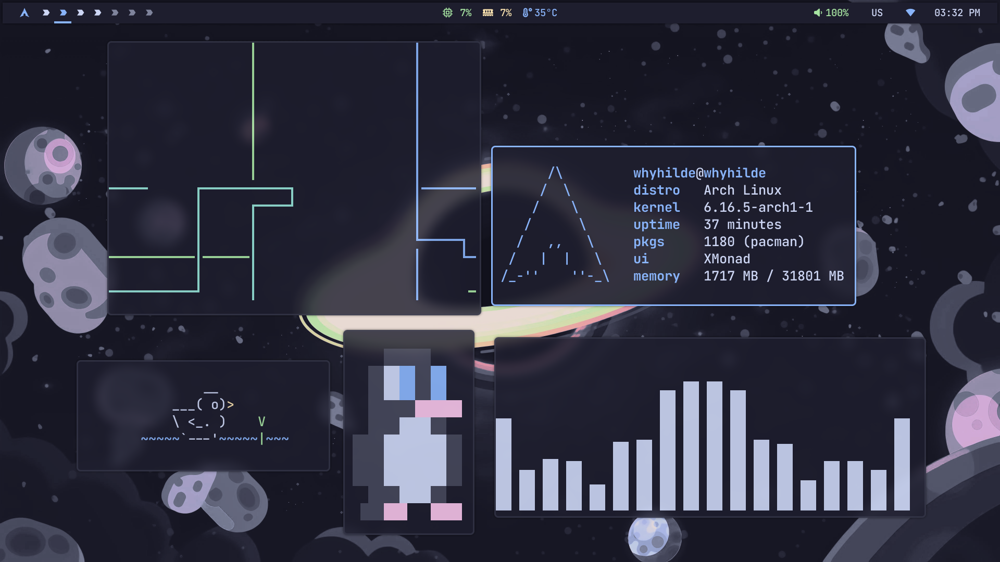
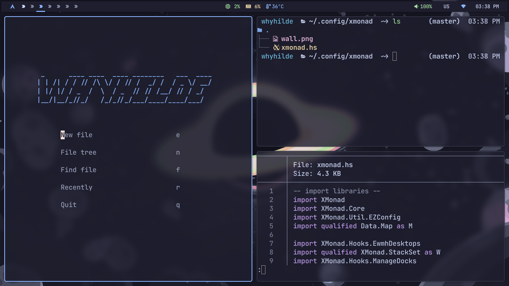
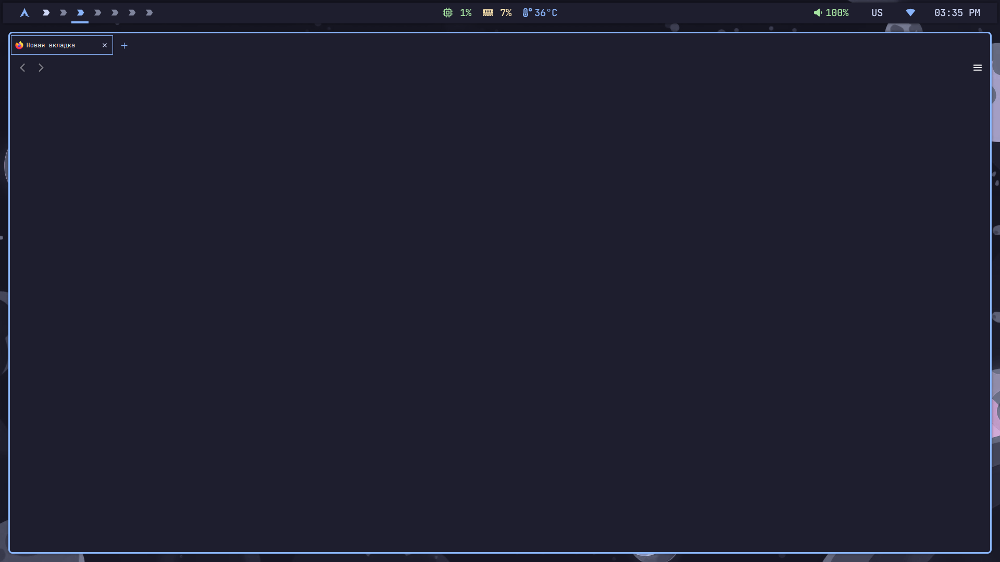
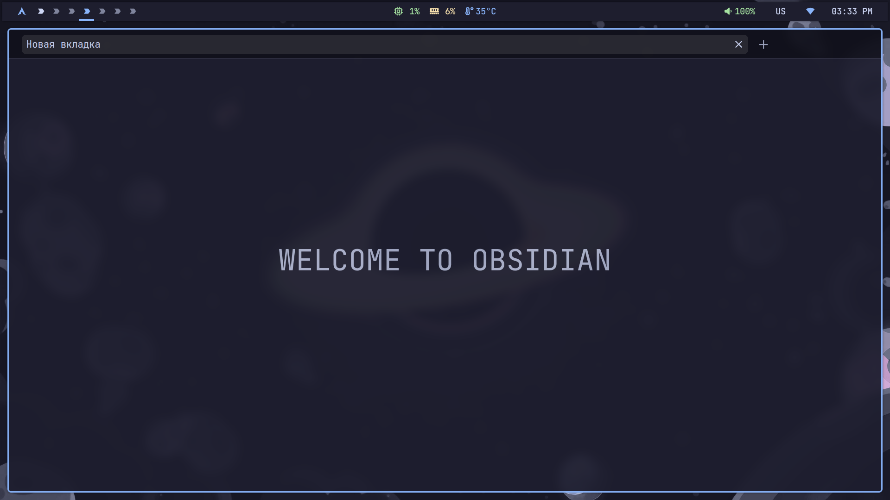
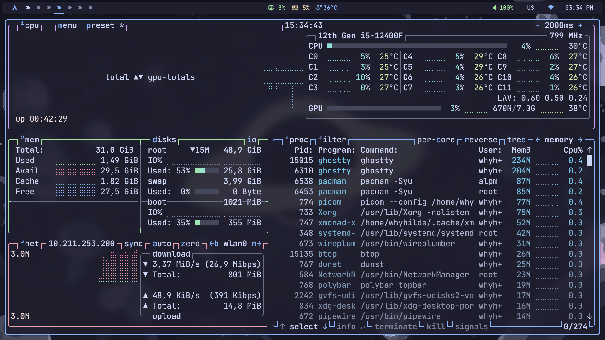
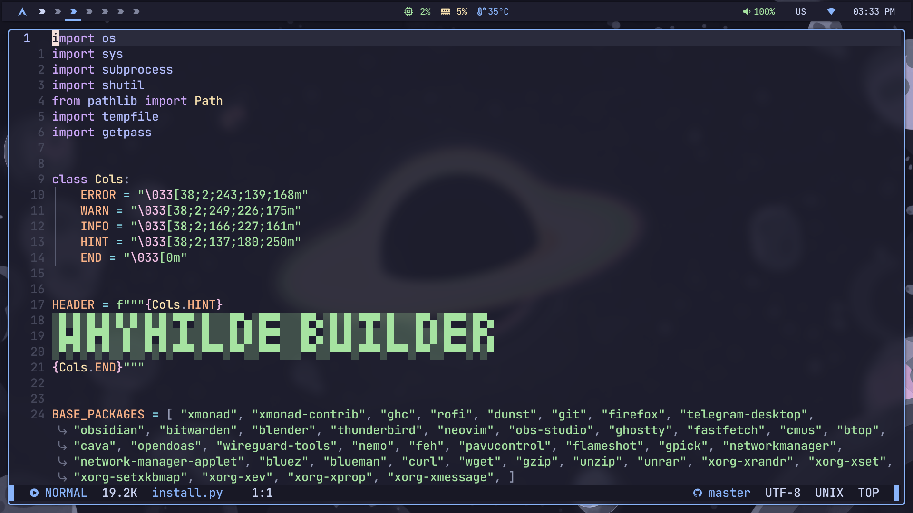

<h1 align="center"> WHYHILDE RICE </h1>
<p align="center">
  
  
  
  
  
</p>


## :blue_book: INFO

| Distro         | Arch Linux                                              |
| -------------- | ------------------------------------------------------- |
| Window Manager | [Xmonad](https://xmonad.org/)                           |
| Bar            | [Polybar](https://github.com/polybar/polybar)           |
| Compositor     | [Picom](https://github.com/pijulius/picom)              |
| App Launcher   | [Rofi](https://github.com/davatorium/rofi)              |
| Notification   | [Dunst](https://github.com/dunst-project/dunst)         |
| Browser        | [Firefox](https://github.com/topics/firefox-browser)    |
| Terminal       | [Ghostty](https://ghostty.org/)                         |
| Shell          | [Zsh](https://www.zsh.org/)                             |
| Code Editor    | [Neovim](https://github.com/neovim/neovim)              |
| Fetch          | [Fastfetch](https://github.com/fastfetch-cli/fastfetch) |
| Visualiser     | [Cava](https://github.com/karlstav/cava)                |


## :rocket: FEATURES

- Beautiful and minimalistic system.
- Customizing software on the system.
- All hotkeys are honed for maximum productivity.
- A very lightweight system that consumes less than 1GB of memory.
- Automatic installation and configuration of all basic software for development.


## :camera: SCREENSHOTS









## :wrench: INSTALLATION

### :warning: WARNING
This installation script only works on Arch Linux.
This Configuration is designed for 1920X1080 monitors, some functionality of the shell may not work as it should. In this case you need to make adjustments manually.
If you find errors in the shell, please report the problem.

### :bulb: STEPS

**1. install python and curl:**

```bash
sudo pacman -S python curl
```

**2. download builder script:**

```bash
curl -O https://raw.githubusercontent.com/whyhilde/dot-files/master/install.py
```

**3. run builder:**

```bash
python ./install.py
```


## :computer: HOTKEYS

| Action                                 | Key               |
| -------------------------------------- | ------------------|
| Move window focus                      | Super + j/k       |
| Move focus window                      | Super + Alt + j/k |
| Switch to another workspace            | Super + 1/7       |
| Move window to another workspace       | Super + Alt + 1/7 |
| Kill focused window                    | Super + c         |
| Toggle floating mode of focused window | Super + f         |
| Open terminal                          | Super + enter     |
| Open application launcher              | Super + d         |
| Open power menu                        | Super + x         |
| Restart Xmonad                         | Super + Alt + r   |
| Take screenshot                        | Ctrl + Super + s  |
| Take fullscreen screenshot             | Ctrl + Super + f  |

**The other hotkeys are in ~/.config/xmonad/xmonad.hs.**
