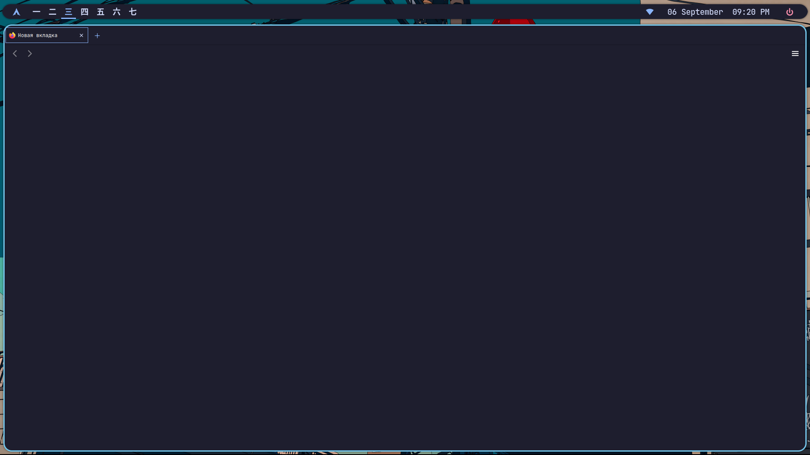

<h1 align="center"> WHYHILDE QTILE RICE </h1>
<p align="center">
  
  
  
  
</p>


## 📖 INFO

| Distro                     | Arch Linux                                           |
| -------------------------- | ---------------------------------------------------- |
| Window Manager and Bar     | [Qtile](https://qtile.org/)                          |
| Compositor                 | [Picom](https://github.com/pijulius/picom)           |
| App Launcher and Powermenu | [Rofi](https://github.com/davatorium/rofi)           |
| Display Manager            | [Sddm](https://github.com/sddm/sddm)                 |
| Notification               | [Dunst](https://github.com/dunst-project/dunst)      |
| Browser                    | [Firefox](https://github.com/topics/firefox-browser) |
| Terminal                   | [Ghostty](https://ghostty.org/)                      |
| Shell                      | [Zsh](https://www.zsh.org/)                          |
| Code Editor                | [Neovim](https://github.com/neovim/neovim)           |
| Fetch                      | [Neofetch](https://github.com/dylanaraps/neofetch)   |
| Visualiser                 | [Cava](https://github.com/karlstav/cava)             |


## :rocket: FEATURES

- Beautiful and minimalistic system.
- Customizing software on the system.
- All hotkeys are honed for maximum productivity.
- A very lightweight system that consumes less than 1GB of memory.
- Automatic installation and configuration of all basic software for development.


## 📸 SCREENSHOTS





## :wrench: INSTALLATION

### :warning: WARNING
This installation script only works on Arch Linux.
This Configuration is designed for 1920X1080 monitors, some functionality of the shell may not work as it should. In this case you need to make adjustments manually.
If you find errors in the shell, please report the problem.

### Steps

**1. install python and curl:**

```bash
sudo pacman -S python curl
```

**2. download builder script:**

```bash
curl -O https://raw.githubusercontent.com/whyhilde/dot-files/master/install.py
```

**3. run builder with sudo:**

```bash
sudo python ./install.py
```


## :computer: HOTKEYS

- Move window focus: super + h/j/k/l
- Move focus window: super + alt + h/j/k/l
- Switch to another workspace: super + 1/7
- Move the window to another workspace: super + alt + 1/7
- Close focused window: super + c
- Switch the window to floating mode: super + f
- Switch the window to fullscreen: super + s
- Open the terminal: super + enter
- Open the application menu: super + d
- Open the power menu: super + x
- Restart Qtile: super + alt + r
- Take a screenshot: ctrl + super + s
- Take a fullscreen screenshot: ctrl + super + f

The other hotkeys are in ~/.config/qtile/config.py.


## :bookmark: LICENSE


